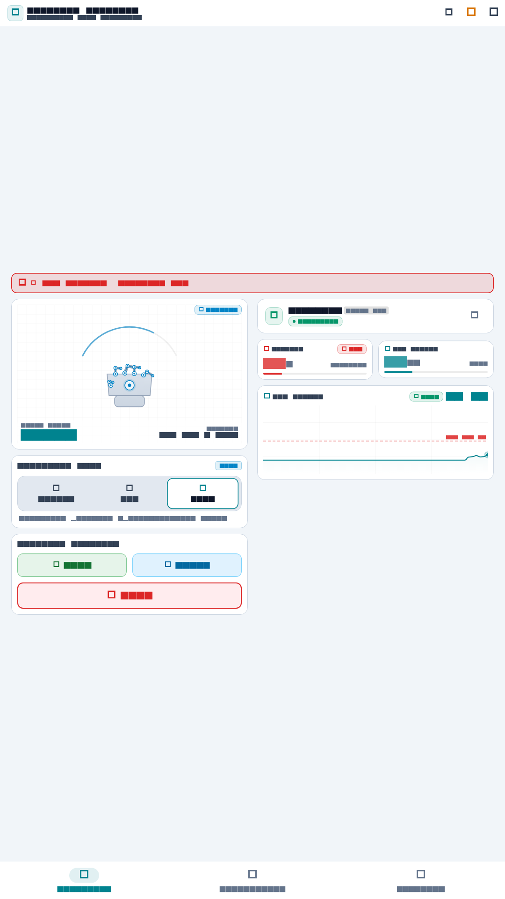
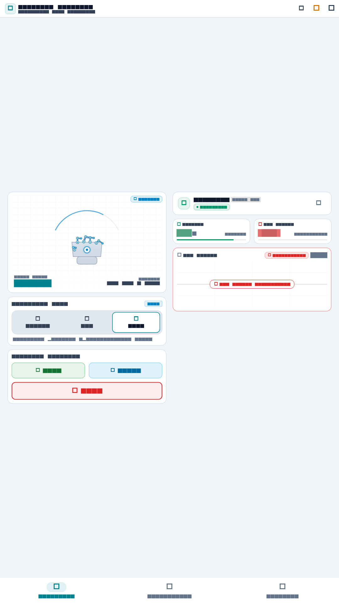
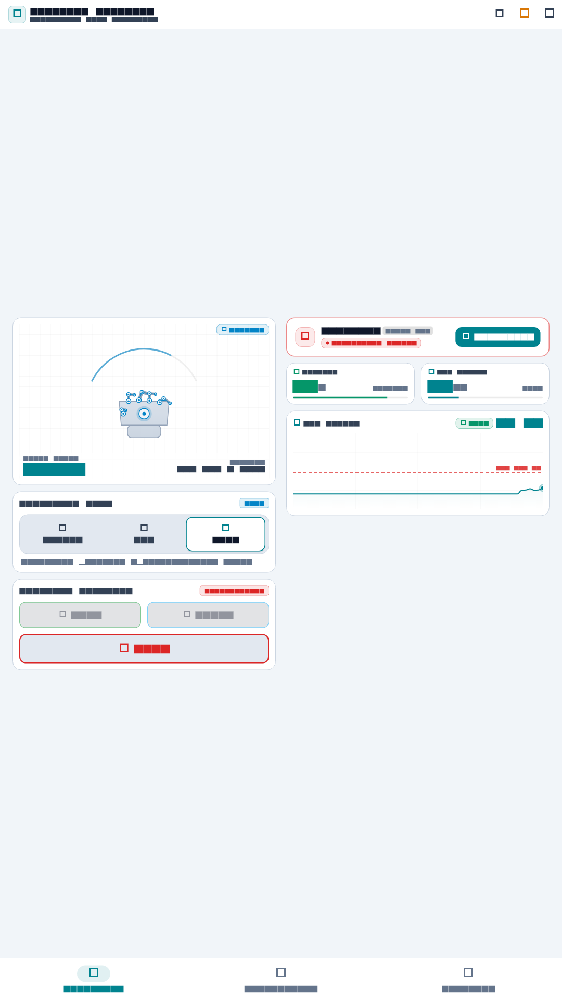
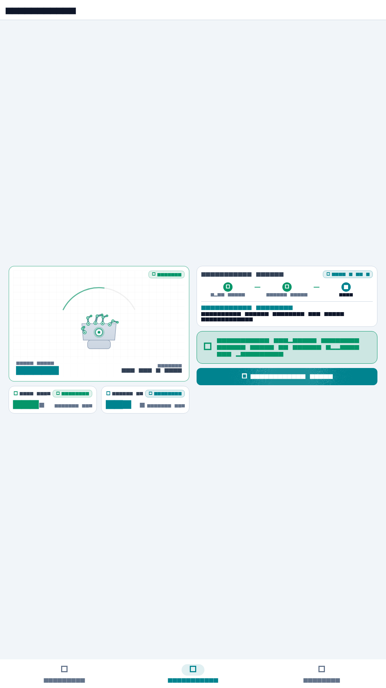

# Synthera Robotics Prosthetic Hand Simulator

A cross-platform mobile application and embedded hardware simulation platform designed for the Synthera Robotics ESP32-based Prosthetic Hand (DAKSH-01).

---

## 1. Project Overview

This application serves as an operator console and digital twin for the Synthera DAKSH-01 bionic prosthetic hand. It implements:
- Real-time telemetry monitoring (angular position, EMG bio-potential, battery level, operational state).
- Multi-mode operational control (MANUAL, EMG bio-signal triggered, and AUTO cyclic sequence).
- Interactive 3-step guided calibration with physical endpoint validation.
- Hardware abstraction layer communicating over canonical serial wire protocol text frames, interchangeable with BLE GATT production drivers.

---

## 2. Live Demo

- **Hosted Web Application**: [https://sumitboii.github.io/Robotic/](https://sumitboii.github.io/Robotic/)
- *Note:* GitHub Pages must be enabled in repository settings pointing to the `gh-pages` branch or deployment artifact.
- **Local Web Server**: Run `python -m http.server 8080 --directory build/web` and navigate to `http://localhost:8080`.

---

## 3. Technologies Used

- **Flutter & Dart**: Cross-platform reactive UI framework and strongly-typed object-oriented language for mobile, desktop, and web.
- **Riverpod (`flutter_riverpod: ^2.5.1`)**: Compile-time safe, testable state management and dependency injection decoupled from the widget tree.
- **fl_chart (`^0.68.0`)**: Performance-optimized oscilloscope plotting library for real-time biosensor streams.
- **shared_preferences (`^2.2.3`)**: Platform-agnostic persistent key-value storage for device settings and calibration limits.
- **Inter & IBM Plex Mono Fonts**: Variable typography assets bundled locally for high-contrast clinical legibility and tabular figure alignment.
- **device_preview (`^1.2.0`)**: Multi-device viewport simulation utility (isolated exclusively to `lib/main_preview.dart`).

---

## 4. Application Architecture

The application is structured into four isolated architectural layers:

```
+-------------------------------------------------------------------------+
|                           PRESENTATION LAYER                            |
|  DashboardScreen  •  CalibrationScreen  •  SettingsScreen  •  AppRouter |
|  HandVisualizer   •  EmgGraph           •  BatteryIndicator•  Controls  |
+------------------------------------+------------------------------------+
                                     | (Riverpod StateNotifiers & Streams)
+------------------------------------v------------------------------------+
|                        APPLICATION / STATE LAYER                        |
|  DeviceProviders  •  SettingsProvider  •  CalibrationProvider  •  Theme |
+------------------------------------+------------------------------------+
                                     | (Pure Domain Models & Commands)
+------------------------------------v------------------------------------+
|                              DOMAIN LAYER                               |
|  DeviceTelemetry  •  DeviceCommand  •  DeviceSettings  •  OperatingMode |
|  HandState        •  ConnectionState•  CalibrationState•  WireProtocol  |
+------------------------------------+------------------------------------+
                                     | (DeviceService Interface)
+------------------------------------v------------------------------------+
|                    DATA & INFRASTRUCTURE LAYER                          |
|  DeviceService (Abstract Interface)                                     |
|  |-- MockDeviceService ---------> SimulatedEsp32 --> SimulatedHand      |
|  |-- BleDeviceService  ---------> ESP32 BLE GATT --> Physical Actuator  |
|  +-- LocalSettingsRepository ---> SharedPreferences Persistence         |
+-------------------------------------------------------------------------+
```

Architectural layer boundaries are strictly verified via automated tests (`test/architecture/layer_boundaries_test.dart`):
- `lib/domain/` contains zero dependencies on Flutter or outer layers.
- `lib/presentation/` interacts exclusively with the `DeviceService` interface and never imports simulation models.
- `lib/application/` interacts exclusively with abstractions, with only the composition root (`device_providers.dart`) instantiating the service implementation.

---

## 5. How the Simulated Device Works

The simulation engine (`SimulatedEsp32`) executes a continuous 20 Hz tick loop modeling embedded hardware behavior:

1. **Kinematics Engine**: `SimulatedProstheticHand` models smooth angular velocity transitions ($0.0^\circ$ to $63.0^\circ$), velocity damping, and mechanical limit clamping.
2. **EMG Bio-Potential Model**: Synthesizes a baseline oscillating carrier wave ($52\,\mu\text{V}$) with stochastic noise and contraction bursts ($>120\,\mu\text{V}$). A hysteresis edge trigger prevents multiple triggers from a single muscle contraction.
3. **Battery Model**: Active discharge simulation draining power at $0.08\%/\text{s}$ during motion and $0.008\%/\text{s}$ while idle. Triggers a prominent warning at $\le 20\%$ and automatic motor cutoff at $0\%$.
4. **Operating Modes**:
   - **MANUAL**: Direct execution of `OPEN`, `CLOSE`, and priority `EMERGENCY STOP`.
   - **EMG**: Bio-potential threshold triggers alternating close $\leftrightarrow$ open transitions.
   - **AUTO**: Autonomous cyclic sequence (`OPEN` $\to$ hold $1.6\,\text{s}$ $\to$ `CLOSE` $\to$ hold $1.6\,\text{s}$).
5. **Canonical Wire Protocol**: Emits and parses single-line plain text frames over a serial text stream:
   ```text
   BATTERY:82 POSITION:45 EMG:127 MODE:AUTO STATE:HOLDING
   ```

---

## 6. How to Connect to ESP32 / BLE

The application is architected for drop-in connectivity with physical ESP32 hardware via BLE GATT:

### GATT Service Specification
- **Service UUID**: `6E400001-B5A3-F393-E0A9-E50E24DCCA9E` (Synthera Prosthetic Service)
- **RX Characteristic UUID (Write)**: `6E400002-B5A3-F393-E0A9-E50E24DCCA9E` (Commands from App $\to$ ESP32)
- **TX Characteristic UUID (Notify)**: `6E400003-B5A3-F393-E0A9-E50E24DCCA9E` (Telemetry 20 Hz from ESP32 $\to$ App)

### Hardware Driver Swap
In `lib/application/providers/device_providers.dart`, replace:
```dart
final deviceServiceProvider = Provider<DeviceService>((ref) {
  final service = MockDeviceService();
  ref.onDispose(() => service.dispose());
  return service;
});
```
with:
```dart
final deviceServiceProvider = Provider<DeviceService>((ref) {
  final service = BleDeviceService(targetDeviceId: 'DAKSH-01');
  ref.onDispose(() => service.dispose());
  return service;
});
```
Zero modifications are required anywhere in UI screens or presentation widgets.

---

## 7. Installation and Run Instructions

### Prerequisites
- Flutter SDK (version 3.24.5 or compatible)
- Dart SDK (version 3.5.4 or compatible)

### Setup & Run
```bash
# Clone repository
git clone https://github.com/Sumitboii/Robotic.git
cd Robotic

# Install dependencies
flutter pub get

# Run test suite
flutter test

# Run application on Chrome / Web
flutter run -d chrome

# Run application on Windows desktop
flutter run -d windows
```

For complete test suite details and mutation test documentation, see [docs/TESTING.md](docs/TESTING.md).

---

## 8. Screenshots

| Dashboard (Light) | Dashboard (Dark) | Calibration Wizard |
|:---:|:---:|:---:|
|  |  |  |

| EMG Mode Trigger | AUTO Cyclic Mode | Emergency STOP |
|:---:|:---:|:---:|
|  |  |  |

| Low Battery Banner | EMG Sensor Fault State | Connection Failure & Retry |
|:---:|:---:|:---:|
|  |  |  |

| Disconnected State | Device Settings | Calibration Complete |
|:---:|:---:|:---:|
|  |  |  |

*Note on screenshot production: All screenshots are programmatic golden renders generated via `test/screenshot_generator_test.dart`.*

---

## 9. Known Limitations

- **Physical BLE Hardware**: BLE GATT integration is implemented and unit-tested architecturally (`BleDeviceService`), but was not verified on a physical ESP32 microcontroller in this testing environment.
- **Android Target**: Android runtime verification was performed via unit, widget, and responsive viewport tests; the Android APK build was not executed locally due to the absence of the Android SDK on the host machine.
- **Headless Host Environment**: Desktop and Web execution verification were conducted via automated test harnesses and headless release bundle compilation.
