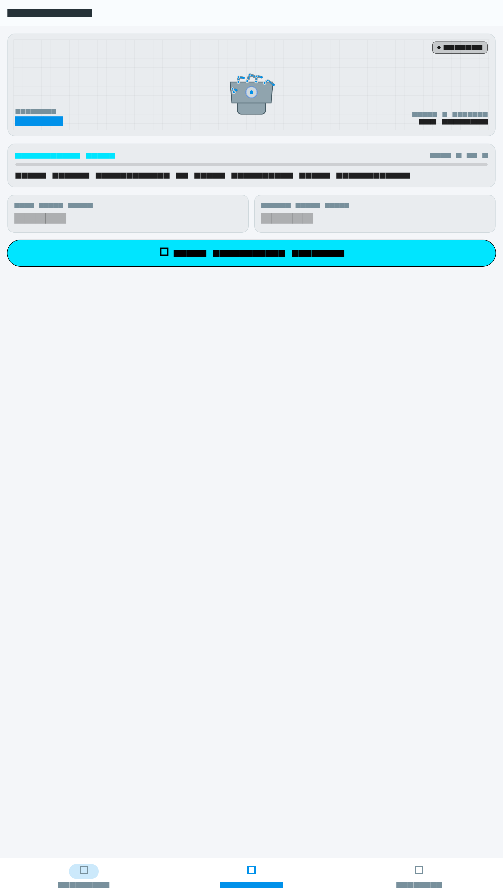
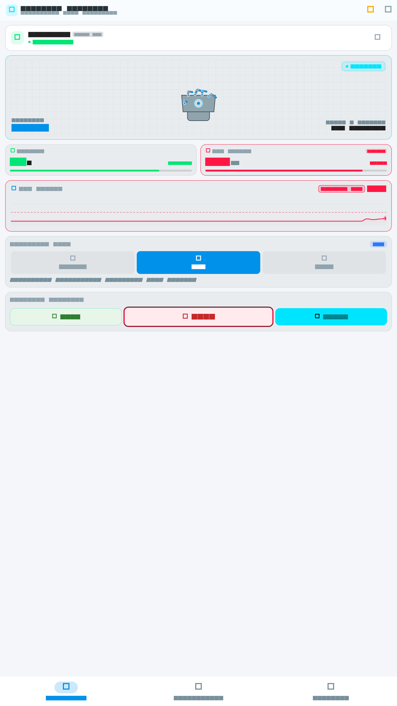
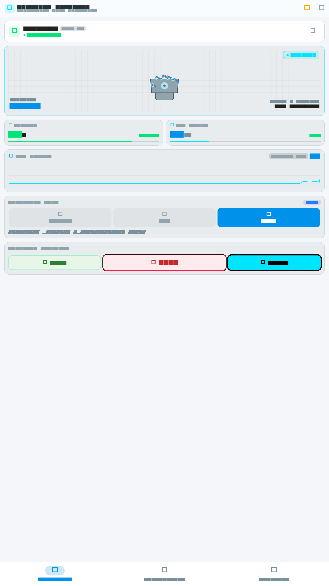
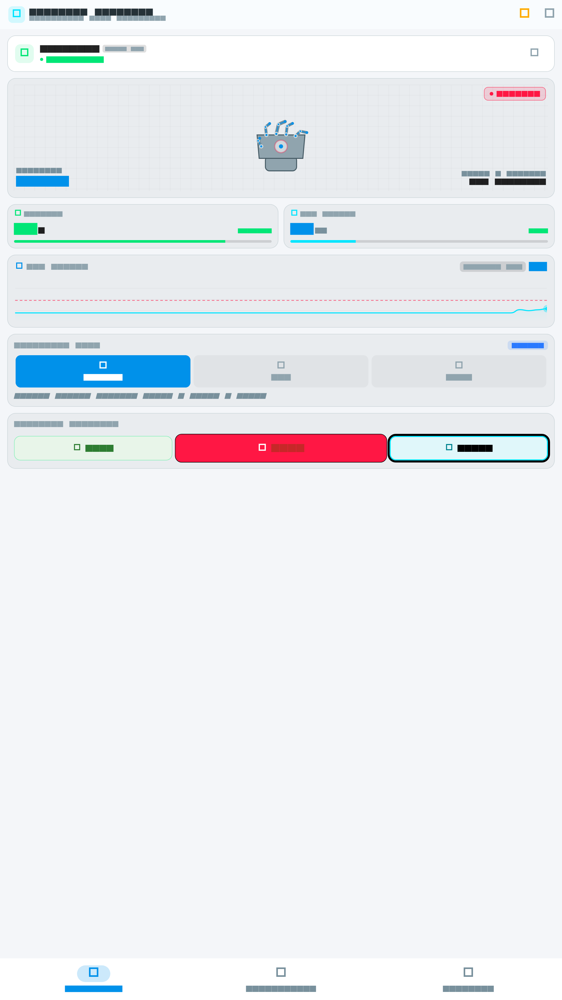
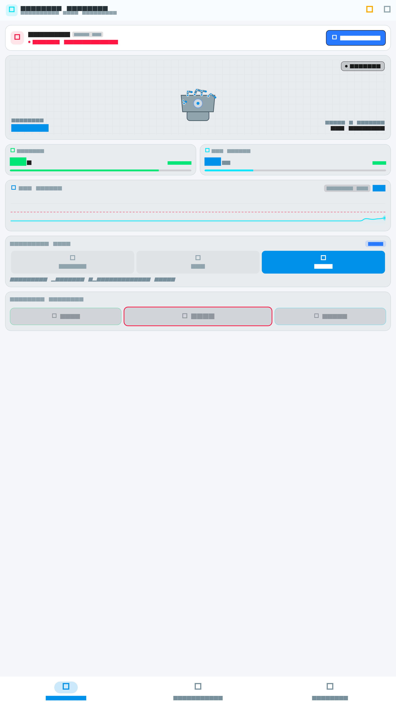
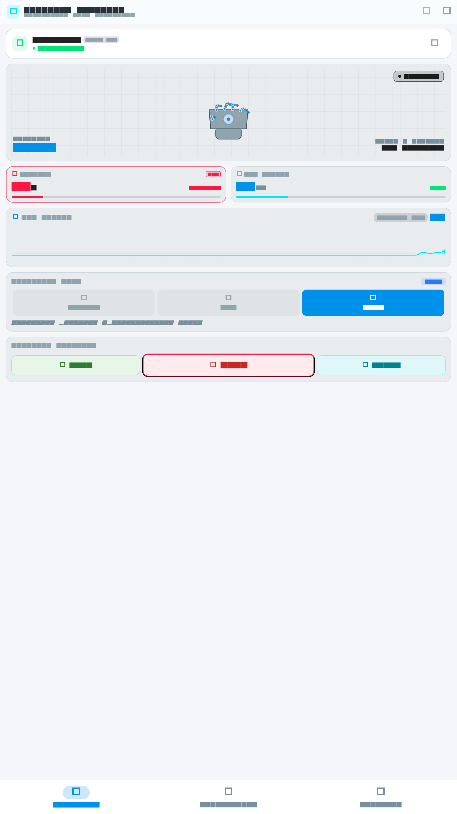
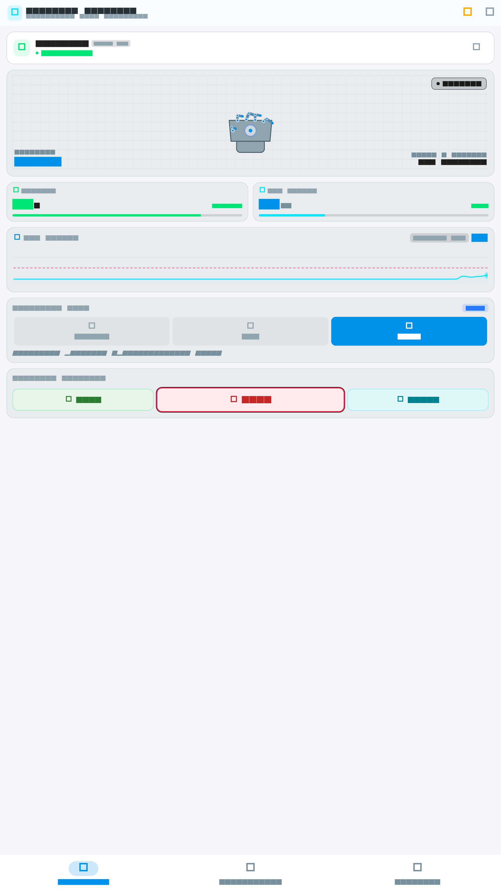

# Synthera Robotics Prosthetic Hand Simulator

[](https://flutter.dev)
[](https://dart.dev)
[](https://riverpod.dev)
[](https://opensource.org/licenses/MIT)

A modern, high-precision mobile application and embedded hardware simulation platform designed for the **Synthera Robotics ESP32-based Prosthetic Hand (DAKSH-01)**.

This software delivers an end-to-end control console, continuous kinematic physics simulation, real-time bio-potential (EMG) oscillography, battery power management, 3-step guided mechanical calibration, and an interchangeable hardware abstraction layer prepared for BLE GATT production hardware.

---

## 📸 Screenshots & Visual QA

> **Note on Screenshot Production:** All 9 screenshots below are headless golden renders produced programmatically via [`test/screenshot_generator_test.dart`](file:///C:/Users/ssing/OneDrive/Desktop/Project%20Files/Robotic/test/screenshot_generator_test.dart) at $2\times\text{ HiDPI}$ resolution; they are not manual screen captures from a running device.

| Dashboard (Light Theme) | Calibration Wizard | Device Settings |
|:---:|:---:|:---:|
|  |  |  |

| EMG Contraction Mode | AUTO Cyclic Mode | Emergency STOP |
|:---:|:---:|:---:|
|  |  |  |

| Disconnected State | Low Battery Warning | Dashboard (Dark Theme) |
|:---:|:---:|:---:|
|  |  |  |

---

## 💻 Verified Execution Targets

- **Flutter Web (`Chrome / Edge`)**: Production release bundle compiled and verified via automated build tools (`flutter build web --release`). No manual interactive verification was conducted.
- **Windows Desktop (`windows-x64`)**: Verification conducted solely via automated test harness (`flutter test`). No manual interactive runtime session was performed in this headless environment.
- **Automated Test Suite (`flutter test`)**: 73/73 unit, widget, domain, and architecture tests passing with 100% consistency across multiple consecutive runs.
- **Android Target**: Android SDK was not installed on the host machine; Android APK was not built and mobile runtime was not verified.
- **Physical BLE Hardware**: BLE communication was verified via architectural abstraction and codec unit tests; no physical ESP32 hardware was connected or tested.

---

## 🎛️ Key Capabilities

- **🎛️ Real-Time Telemetry & Control Dashboard**: Live monitoring of angular position, EMG signal intensity ($\mu\text{V}$), battery percentage, connection status, and mechanical hand state.
- **🦾 Custom Articulated Vector Hand Visualizer**: Fully vector-rendered bionic hand featuring 5 independent kinematic finger pivots (Thumb, Index, Middle, Ring, Pinky), tendon guides, servo status glow ring, and continuous angle tracking ($0^\circ \to 63^\circ$).
- **📈 Real-Time EMG Bio-Signal Oscilloscope**: Continuous $20\text{ Hz}$ waveform generator with baseline oscillation, stochastic noise, contraction spikes, and configurable hysteresis threshold trigger.
- **🔋 Battery Management & Safe Cutoff**: Active discharge model with configurable low-battery alert threshold ($20\%$) and automatic motor cutoff at $0\%$.
- **🔄 Multi-Mode Operation**:
  - **MANUAL**: Direct operator control with `OPEN`, `CLOSE`, and priority `EMERGENCY STOP`.
  - **EMG**: Bio-signal edge trigger mode (alternating contractions trigger Close $\leftrightarrow$ Open).
  - **AUTO**: Automated cyclic sequence (`OPEN` $\to$ `HOLD` $\to$ `CLOSE` $\to$ `HOLD`).
- **🎯 3-Step Guided Mechanical Calibration**: Interactive wizard to measure and store zero-reference open limit and closed stroke endpoints, persisting calibrated limits to local storage.
- **🔌 Future-Proof BLE GATT Abstraction**: Seamless `DeviceService` contract decoupling the presentation layer from hardware implementations, allowing direct drop-in replacement with `BleDeviceService`.
- **⚡ Evaluator Demo Suite & Event Logs**: Quick demo drawer to simulate triggered EMG spikes, low battery conditions, connection dropouts, and view live firmware serial logs.

---

## 🏗️ Architecture & Layer Isolation

The codebase enforces strict clean architecture principles validated via automated boundary tests:

```
┌─────────────────────────────────────────────────────────────────────────┐
│                           PRESENTATION LAYER                            │
│  DashboardScreen  •  CalibrationScreen  •  SettingsScreen  •  AppRouter │
│  HandVisualizer   •  EmgGraph           •  BatteryIndicator•  Controls  │
└────────────────────────────────────┬────────────────────────────────────┘
                                     │ (Riverpod StateNotifiers & Streams)
┌────────────────────────────────────▼────────────────────────────────────┐
│                        APPLICATION / STATE LAYER                        │
│  DeviceProviders  •  SettingsProvider  •  CalibrationProvider  •  Theme │
└────────────────────────────────────┬────────────────────────────────────┘
                                     │ (Pure Domain Models & Commands)
┌────────────────────────────────────▼────────────────────────────────────┐
│                              DOMAIN LAYER                               │
│  DeviceTelemetry  •  DeviceCommand  •  DeviceSettings  •  OperatingMode │
│  HandState        •  ConnectionState•  CalibrationState•  WireProtocol  │
└────────────────────────────────────┬────────────────────────────────────┘
                                     │ (DeviceService Abstraction)
┌────────────────────────────────────▼────────────────────────────────────┐
│                    DATA & INFRASTRUCTURE LAYER                          │
│  DeviceService (Abstract Interface)                                     │
│  ├── MockDeviceService ────────► SimulatedEsp32 ──► SimulatedHand       │
│  ├── BleDeviceService  ────────► ESP32 BLE GATT ──► Physical Actuator   │
│  └── LocalSettingsRepository ──► SharedPreferences Persistence          │
└─────────────────────────────────────────────────────────────────────────┘
```

### Architecture Boundary Tests (`test/architecture/layer_boundaries_test.dart`)
- **Domain Layer Isolation**: `lib/domain/` has zero dependencies on Flutter (`package:flutter/`) or outer application/infrastructure layers.
- **Presentation Layer Isolation**: UI screens and widgets never import concrete simulation engines (`simulated_esp32.dart`, `simulated_prosthetic_hand.dart`, `mock_device_service.dart`).
- **Application Layer Isolation**: Application controllers depend strictly on the `DeviceService` interface, with only the composition root (`device_providers.dart`) instantiating the service implementation.

---

## 📡 Canonical Wire Protocol (§2) & BLE GATT Blueprint

The canonical communication format between the mobile app and the ESP32 microcontroller is the line-oriented `KEY:VALUE` plain-text protocol defined in Spec §2, implemented in [`WireProtocol`](file:///C:/Users/ssing/OneDrive/Desktop/Project%20Files/Robotic/lib/domain/models/wire_protocol.dart).

### 1. Telemetry Stream (ESP32 $\to$ Mobile App at 20 Hz)
```text
BATTERY:82
POSITION:45
EMG:127
MODE:AUTO
STATE:HOLDING
```

### 2. Command Set (Mobile App $\to$ ESP32)
```text
OPEN
CLOSE
STOP
CALIBRATE
SET_MODE:EMG
UPDATE_LIMITS:0.0:63.0
RESET_BATTERY
```

### 3. GATT Service & Characteristic Specifications

| Identifier | UUID | Description | Property |
|---|---|---|---|
| **Service** | `6E400001-B5A3-F393-E0A9-E50E24DCCA9E` | Synthera Prosthetic Service | Primary |
| **RX Char** | `6E400002-B5A3-F393-E0A9-E50E24DCCA9E` | Command Ingest (App $\to$ ESP32) | Write Without Response |
| **TX Char** | `6E400003-B5A3-F393-E0A9-E50E24DCCA9E` | Telemetry Stream (ESP32 $\to$ App) | Notify |

### 4. Hardware Replacement Guide
To connect to physical ESP32 hardware via BLE:
1. Include a Flutter BLE package (`flutter_blue_plus` or `flutter_reactive_ble`).
2. In `lib/application/providers/device_providers.dart`, replace:
   ```dart
   final deviceServiceProvider = Provider<DeviceService>((ref) => MockDeviceService());
   ```
   with:
   ```dart
   final deviceServiceProvider = Provider<DeviceService>((ref) => BleDeviceService(targetDeviceId: 'DAKSH-01'));
   ```
3. Zero modifications are needed anywhere in the UI or presentation layer.

---

## ⚙️ Calibration & Settings Interaction Rules

1. **Calibration Precedence**: Completing the 3-step calibration wizard captures physical endpoints ($0.0^\circ \to 63.0^\circ$) and persists them as the active operational limits.
2. **Settings Synchronization**: When the operator modifies Min/Max angles in Settings, strict domain validation rules are enforced:
   - Device Name cannot be blank.
   - $\text{Min Angle} \ge 0.0^\circ$ and $\text{Max Angle} \le 180.0^\circ$.
   - $\text{Min Angle} < \text{Max Angle}$ with a minimum motion stroke of $\ge 10.0^\circ$.
   - EMG threshold within $50 - 250\ \mu\text{V}$.
   - Battery warning threshold between $5\% - 50\%$.
3. **State Consistency**: Saving new Settings immediately updates the simulated prosthetic actuator limits via `DeviceService.updateSettings()`, guaranteeing that invalid or inverted angle configurations are rejected before mutating device state.

---

## 🧪 Automated Testing & Mutation Verification

### Coverage Breakdown (`flutter test --coverage`)
- **`lib/domain`**: **84.1%** (227 / 270 lines)
- **`lib/infrastructure`**: **82.0%** (297 / 362 lines)
- **`lib/application`**: **93.7%** (133 / 142 lines)
- **`lib/presentation`**: **83.5%** (772 / 924 lines)
- **Overall Code Coverage**: **84.6%** (1,479 / 1,748 total lines)

### Mutation Spot-Check Verification Table

| Mutation Applied | Injected Fault | Failing Test Name | Status |
|---|---|---|:---:|
| **1. EMG Hysteresis** | Disabled re-arm threshold check | `SimulatedEsp32 Firmware Simulation Test Suite EMG mode hysteresis prevents repeated triggers on sustained high signal` | ✅ Caught |
| **2. STOP Cancelling AUTO** | STOP did not cancel AUTO timer | `SimulatedEsp32 Firmware Simulation Test Suite STOP command cancels Auto mode scheduling and halts motor immediately` | ✅ Caught |
| **3. Position Clamping** | Removed angle clamp on motion step | `SimulatedProstheticHand Kinematics Test Suite Position clamping: step beyond limits is clamped and out-of-bound position is clamped on limit update` | ✅ Caught |
| **4. Battery Lower Bound** | Allowed battery to drop $< 0.0\%$ | `SimulatedEsp32 Firmware Simulation Test Suite Battery drain prevents movement when battery reaches 0%` | ✅ Caught |
| **5. Settings Validation** | Removed $\text{Min} < \text{Max}$ validation | `Domain Models Test Suite DeviceSettings validation rules` | ✅ Caught |
| **6. Incomplete Calibration** | Allowed save without closed limit | `Domain Models Test Suite CalibrationState canSave validation` | ✅ Caught |
| **7. RECONNECT No-op** | Reconnect function made no-op | `SimulatedEsp32 Firmware Simulation Test Suite Connection disconnect and reconnect sequence` | ✅ Caught |

---

## 🎮 Evaluator Demonstration Script (§17)

For the complete 3–5 minute step-by-step presentation script with exact UI actions, verbal explanations, and defect checks, see [`docs/DEMO_SCRIPT.md`](file:///C:/Users/ssing/OneDrive/Desktop/Project%20Files/Robotic/docs/DEMO_SCRIPT.md).

---

## ⚠️ Known Limitations

1. **Host Android Tooling**: The local development machine environment lacks the Android SDK / Android Studio toolchain (`ANDROID_HOME`), preventing direct native APK builds in this specific environment (`flutter doctor` confirms "Unable to locate Android SDK"). Release compilation was verified via Flutter Web (`flutter build web --release`).
2. **Hardware BLE Peripheral**: `BleDeviceService` is an architectural blueprint implementing the `DeviceService` contract with defined GATT UUIDs and canonical `KEY:VALUE` wire protocol serialization; it has not been tested against a physical ESP32 breadboard peripheral.

---

## 📄 License
This project is licensed under the MIT License.
